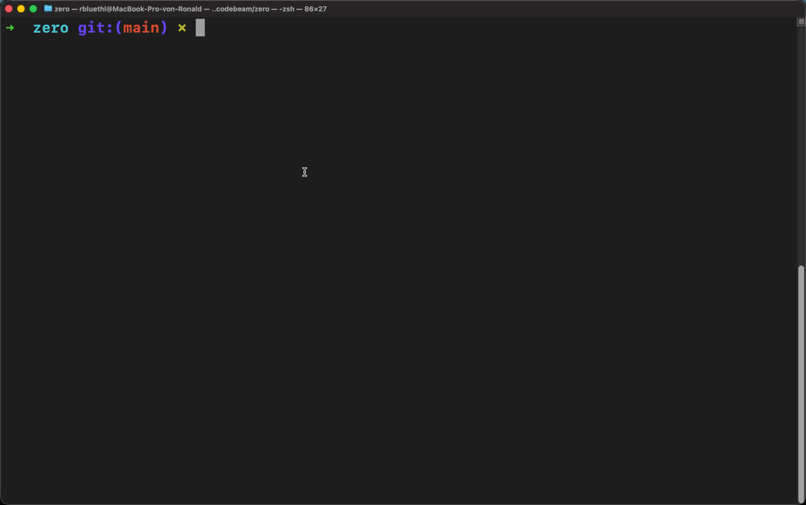

<p align="center">
  
</p>

<p align="center">
  The fastest way to ship containers to your own server.<br>
  One command. Automatic HTTPS. Zero config.
</p>

<p align="center">
  
</p>

```bash
zero deploy ghcr.io/shipzero/demo:latest
# 🚀 Your app is live: https://demo.example.com
```

Platforms like Vercel and Railway have great DX — but they're expensive, lock you in, and don't support arbitrary Docker images. Self-hosting is flexible and cheap, but getting a container live with HTTPS means wiring up nginx, Certbot, deploy scripts, and hoping nothing breaks.

zero closes that gap. You point it at a Docker image, and it handles everything else — port detection, domain routing, TLS, health checks, zero-downtime swaps. Zero config files. Zero moving parts. Just one command and your app is live.

## Quickstart

### 1. Set up the server

> On your VPS

Any Linux VPS with root access:

```bash
curl -fsSL https://shipzero.sh/install.sh | sudo bash
```

The installer sets up Docker, prompts for your domain and email (for TLS), and starts zero.

### 2. Install the CLI

> On your machine

```bash
curl -fsSL https://shipzero.sh/cli/install.sh | bash
```

### 3. Connect

> On your machine

```bash
zero login root@example.com
```

Authentication uses SSH — if you can SSH into the server, you can use zero.

### 4. Deploy

> On your machine

```bash
zero deploy ghcr.io/shipzero/demo:latest
```

That's it. zero figures out the port, assigns a domain, provisions a TLS certificate, and routes traffic.

```
✓ Pulling image
✓ Starting container
✓ Detected port: 3000
✓ Health check passed
✓ Your app is live: https://demo.example.com
```

## Features

- **HTTPS by default** — certificates are provisioned automatically
- **Zero-downtime** — traffic switches only after the new version is healthy
- **Preview deployments** — `zero deploy myapp --preview pr-21`
- **One-command rollback** — `zero rollback myapp`
- **Webhooks** — push to your registry, zero deploys it
- **No reverse proxy config** — routing is built in
- **Live metrics** — CPU, memory, and network in the terminal

Two dependencies. One container. No database. No web UI. No YAML.

## Deploying

### Docker images

Only the image is required. Everything else is inferred:

| What       | How it works                                                      |
| ---------- | ----------------------------------------------------------------- |
| **Name**   | Last segment of the image path (`ghcr.io/shipzero/demo` → `demo`) |
| **Port**   | Read from the image's `EXPOSE` directive, falls back to `3000`    |
| **Domain** | `<name>.<server-domain>` unless `--host-port` is set              |
| **Health** | TCP connection check, or HTTP `GET` when `--health-path` is set   |

```bash
# Deploy with all defaults
zero deploy ghcr.io/shipzero/demo:latest

# Override any default
zero deploy ghcr.io/shipzero/demo:latest --name api --domain api.example.com --port 8080

# Redeploy an existing app
zero deploy myapp

# Deploy a specific tag
zero deploy myapp --tag v1.2.3

# Expose on a host port instead of a domain
zero deploy ghcr.io/shipzero/demo:latest --host-port 8888
```

All options:

| Flag               | Description                                                       | Default                    |
| ------------------ | ----------------------------------------------------------------- | -------------------------- |
| `--name`           | App name (overrides inferred name)                                | _(from image)_             |
| `--domain`         | Domain for routing and TLS                                        | _`<name>.<server-domain>`_ |
| `--port`           | Internal container port                                           | _(auto-detect)_            |
| `--host-port`      | Expose directly on a host port (skips auto-domain)                | —                          |
| `--tag`            | Image tag to deploy                                               | `latest`                   |
| `--command`        | Container startup command                                         | —                          |
| `--volume`         | Volumes, comma-separated (e.g. `pgdata:/var/lib/postgresql/data`) | —                          |
| `--health-path`    | HTTP health check endpoint                                        | —                          |
| `--health-timeout` | Health check timeout (e.g. `30s`, `3m`)                           | `60s`                      |
| `--env`            | Env vars, comma-separated (e.g. `KEY=val,KEY2=val2`)              | —                          |
| `--preview`        | Deploy as a preview environment                                   | —                          |
| `--ttl`            | Time to live for previews (e.g. `24h`, `7d`)                      | `7d`                       |

### Environment variables

Pass env vars inline with `--env`:

```bash
zero deploy ghcr.io/shipzero/demo:latest --env DATABASE_URL=postgres://localhost/mydb,SECRET_KEY=abc123
```

Or manage them separately — changes take effect on the next deploy:

```bash
zero env set myapp DATABASE_URL=postgres://localhost/mydb SECRET_KEY=abc123
zero env list myapp
zero env remove myapp SECRET_KEY
```

### Volumes

```bash
zero deploy postgres:16 --name postgres --port 5432 --volume pgdata:/var/lib/postgresql/data
```

Format: `source:destination[:mode]`

### Private registries

```bash
zero registry login ghcr.io --user <username> --password <token>
zero registry list
zero registry logout ghcr.io
```

### Docker Compose

For multi-container apps:

```bash
zero deploy --compose docker-compose.yml --service web --name mystack --domain mystack.example.com --port 3000
```

| Flag             | Description                                                           |
| ---------------- | --------------------------------------------------------------------- |
| `--compose`      | Path to a `docker-compose.yml` file (required)                        |
| `--service`      | The entry service that receives traffic (required)                    |
| `--name`         | App name (required)                                                   |
| `--image-prefix` | Shared image prefix for tag substitution (e.g. `ghcr.io/org/project`) |

The Compose file is uploaded to the server. On deploy, zero pulls images, starts services, and health-checks the
entry service before routing traffic.

**`--image-prefix` explained:** When you pass `--image-prefix ghcr.io/you/mystack`, zero replaces the tag of every
image in your Compose file that starts with that prefix. This is what makes `--tag`, webhooks, and preview
deployments work for Compose apps.

```bash
zero deploy --compose docker-compose.yml --service web --name mystack --image-prefix ghcr.io/you/mystack

# Now these work:
zero deploy mystack --tag v2               # updates all matching images to :v2
zero deploy mystack --preview pr-21        # preview with tag :pr-21
```

## Operating apps

### Logs and metrics

```bash
zero logs myapp              # stream app logs
zero logs myapp --tail 500   # last 500 lines (default: 100)
zero logs --server           # stream server logs
zero metrics myapp           # live CPU, memory, network
```

```
myapp

  cpu     ██████░░░░░░░░░░░░░░  28.3%
  memory  ████████████░░░░░░░░  312 MB / 512 MB (60.9%)
  net ↓   1.2 MB/s
  net ↑   340 KB/s
```

### Rollback

```bash
zero rollback myapp
```

Starts a new container from the previous image and swaps traffic once healthy.

### Start, stop, remove

```bash
zero stop myapp              # stop container, traffic returns 502
zero start myapp             # restart and health-check before routing
zero remove myapp            # remove app and all its containers
```

### Domains

Apps can have multiple domains. The first domain is the primary (used for preview subdomains).

```bash
zero domain add myapp staging.myapp.com     # add a domain (no redeploy needed)
zero domain list myapp                      # list all domains
zero domain remove myapp staging.myapp.com  # remove a domain
```

The `--domain` flag on `zero deploy` sets the initial domain when creating an app. Use `zero domain add` for additional domains.

### Deployment history

```bash
zero history myapp
zero list                     # list all apps with status, URL, image
```

## Preview deployments

Spin up a temporary version of any app:

```bash
zero deploy myapp --preview pr-21
# => https://preview-pr-21.myapp.example.com
```

Previews expire automatically (default: 7 days). One flag, temporary URL, automatic cleanup.

```bash
zero deploy myapp --preview feat-1 --tag feat-branch --ttl 24h
zero logs myapp --preview pr-21
zero metrics myapp --preview pr-21
zero remove myapp --preview pr-21
```

## Webhooks

Every app gets a unique webhook URL. Push an image to your registry, zero deploys it automatically.

```bash
zero webhook url myapp
```

Add the URL as a webhook in GitHub Container Registry or Docker Hub. Payloads are verified with HMAC-SHA256.

Non-matching tags automatically create preview deployments when the app has a domain.

## How it works

### Zero-downtime deployment

1. **Pull** — image pulled from the registry
2. **Start** — new container started on an ephemeral port bound to localhost
3. **Health check** — TCP or HTTP check, up to 60 seconds
4. **Swap** — reverse proxy route updated atomically, old container removed

If the health check fails, the new container is discarded. Traffic stays on the previous version.

### Reverse proxy

No nginx. No Traefik. zero includes a built-in reverse proxy:

- Routes requests to containers based on the `Host` header
- TLS termination with automatic certificate selection (SNI)
- Security headers: `Strict-Transport-Security`, `X-Content-Type-Options`, `X-Frame-Options`
- Forwarding headers: `X-Forwarded-For`, `X-Real-IP`, `X-Forwarded-Proto`
- Request timeout: 60s, max body size: 100 MB (configurable via `MAX_BODY_SIZE`)

## Scope

zero is a single-server deployment engine. One server, any number of apps.
If you need multi-node orchestration, team RBAC, or a web dashboard, zero is not the right tool.

## Setup reference

### Server requirements

- Linux server (Ubuntu 22.04+ recommended)
- Root access
- A domain pointing to your server (for HTTPS and automatic subdomains)

### Server configuration

Configuration is stored in `/opt/zero/.env`:

| Variable                 | Description                                     | Default       |
| ------------------------ | ----------------------------------------------- | ------------- |
| `TOKEN`                  | Internal auth token (do not share)              | _(generated)_ |
| `JWT_SECRET`             | Secret for signing JWT tokens                   | _(generated)_ |
| `DOMAIN`                 | Server domain (used for app subdomains and TLS) | _(server IP)_ |
| `EMAIL`                  | Let's Encrypt email (enables automatic TLS)     | —             |
| `API_PORT`               | API server port                                 | `2020`        |
| `CERT_RENEW_BEFORE_DAYS` | Renew certificates this many days before expiry | `30`          |
| `PREVIEW_TTL`            | Default time to live for preview deployments    | `7d`          |
| `MAX_BODY_SIZE`          | Maximum request body size for the reverse proxy | `100m`        |

### Upgrade

```bash
zero upgrade --server        # upgrade remotely via CLI
zero upgrade --canary        # install canary (pre-release) version
```

Or re-run the install script on the server.

### TLS

zero provisions and renews TLS certificates via Let's Encrypt automatically when `EMAIL` is set and `DOMAIN` is a
real domain (not an IP). Certificates are provisioned on first deploy and renewed within 30 days of expiry. HTTP
requests are redirected to HTTPS.

### Uninstall

Server:

```bash
docker compose -f /opt/zero/docker-compose.yml down
rm -rf /opt/zero /var/lib/zero
```

CLI:

```bash
rm -rf ~/.zero
```

## CLI Reference

```
zero <command> [options]

deploy <image-or-app> [options]              Deploy an app (creates if new)
domain <add|remove|list> <app> [domain]      Manage app domains
env <set|list|remove> <app> [args]           Manage environment variables
history <app>                                Show deployment history
list                                         List all apps
login <user@server>                          Authenticate via SSH
logs <app|--server> [--tail <n>] [--preview <label>]
                                             Stream app or server logs
metrics <app|--server> [--preview <label>]   Show live resource usage
registry <login|logout|list> [server]        Manage registry credentials
remove <app> [--preview <label>] [--force]   Remove an app or preview
rollback <app> [--force]                     Roll back to previous deployment
start <app>                                  Start a stopped app
status                                       Show server connection info
stop <app> [--force]                         Stop a running app
upgrade [--server] [--all]                   Upgrade CLI and/or server
version                                      Show CLI and server version
webhook url <app>                            Show and rotate webhook URL
```

## Sponsors

<a href="https://codebeam.com">
  <picture>
    <source media="(prefers-color-scheme: dark)" srcset="sponsors/codebeam_white.svg" />
    <source media="(prefers-color-scheme: light)" srcset="sponsors/codebeam_black.svg" />
    
  </picture>
</a>

## License

[MIT](LICENSE)
